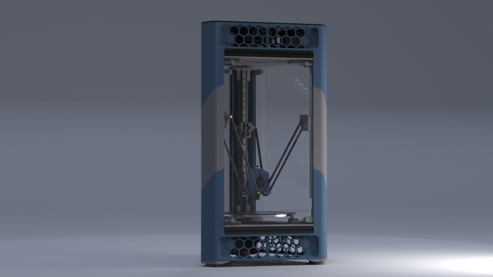

# Doron-Velta

## What's This?

I've never owned a Delta printer, but their unique design and mechanics have always fascinated me. As some of you may know, I contribute to maintaining [Danger-Klipper](https://github.com/DangerKlippers/danger-klipper), which involves testing various configurations and setups. In support of this work, Imac_29 (from the #pasteldenata) generously gifted me an FLSUN Q5. Interestingly, it never even saw the light of day in my home; I disassembled it on the very first day.

This all happened around SMRRF2023, where we humorously speculated that the Voron Design team would never release an official Delta design. What could be a better April Fool's joke than that? So, I went with it.

Originally, the plan was to create an April Fool's prank using the FLSUN Q5, printing parts to make it look like a Voron design. However, I ended up using just the Q5's arms and nothing else. I gathered a collection of spare parts I had lying around, began measuring, and started designing in CAD. After various splits and merges, I had a design reminiscent of the Voron Trident that I was happy enough. It wasn't complete but enough to share with other contributors.

[DoubleT](https://github.com/3DPrintingMods) was immediately on board and decided to build one himself. Within hours of discussing it with me, he had already ordered half of the parts. Interestingly, he managed to get his version printing even before I did.

I want to make it clear that I don't claim to have extensive CAD expertise or experience with Delta printers for this project, so please take my work with a grain of salt. My primary aim was, and remains, to explore Klipper firmware with Delta kinematics.

Yes, the printer works. Yes, it prints. Yes, it's aesthetically pleasing. And yes, it's far from being a perfect design. Most importantly, no, **this is not an official project by Voron Design**.

## **** Disclaimer ****

The toolhead doesn't have the full bed travel. It will hit the panels and/or the belts. New interactions of the printed parts will improve this, but I can't promise it will ever have the full bed travel without a major redesign.
I appreciate any and all the feedback, but I want to ensure everyone understands the design limitations.

## Links

[Doron-Velta Early Bird Kit by FYSETC](https://s.click.aliexpress.com/e/_DejsxX9)\
\
[DV-000 by rogerlz](https://www.reddit.com/r/voroncorexy/comments/1bsr2d7/special_serial_request_dv000_rogerlz/) ([YouTube](https://www.youtube.com/watch?v=DuFxvsZ5HEU))\
[DV-001 by DoubleT](https://www.reddit.com/r/voroncorexy/comments/1bsrmby/special_serial_request_dv001_doublet/) ([YouTube](https://www.youtube.com/watch?v=adXSPTnKe_0))\
[DV-002 by Robert Klotz](https://www.reddit.com/r/voroncorexy/comments/1cw2izk/special_serial_request_dv002_robert_klotz/)\
[DV-003 by Xiar](https://www.reddit.com/r/voroncorexy/comments/1d45y17/special_serial_request_dv_xiar/)\
[DV-004 by Owl47 Bruno Silva](https://discord.com/channels/825469421346226226/1246869064173748285/1246998381964824697)\
[DV-005 by ZombieHedgeDog](https://discord.com/channels/825469421346226226/1246869064173748285/1247178407012208701)
...

## Pictures

 

## Bill of Materials (BOM)
A bill of materials can be found here: [BOM](./BOM.md)

## Changelog

July 13, 2024 (R2 v20)
  - I got an extra ~10mm travel achieved with some improvements on the printed parts. The 2020s moved 5mm to the back, and 2040s moved 5mm to the sides. Almost all printed parts are changing, except the skirts. The only hardware changes are on the ACM panels as they are sligly wider now. The M5x60s are no longer needed.
  - Doron-Velta has a new logo (thanks to @matrixray).
  - I added new skirts with the new logo.
  - There is also a new skirt with a 6020 fan (Thanks to @timmit99 and @seti118 for the fan mount)
  - New UHP-200 mount to compensate the extrusions movement (Thanks to @timmit99)
  - The official toolhead is now [CraneFly by chirpy](https://github.com/chirpy2605/voron/tree/main/general/CraneFly). The MiniSB is hidden in the F3D file, but I won't be making changes to it anymore. Thanks chirpy!
  - Lots of small tweaks here and there based on the community feedback. Thanks everyone.

June 7, 2024 (R1 v30)
  - The interactions are on fire. I invite you to join the DOOMCUBE Discord (#doron_velta_dev) or the Voron Discord (Doron Velta thread) to chat with more people building and modding the design.
  - I got an extra 5mm travel by removing some meat from the belt carriages. That means a new idler mount, new carriage and new endstop mount. No hardware changes.
  - I removed the SKR Pico and Raspberry Pi objects to reduce the cad file size.
  - This makes the Release 1 version with the exported STLs.

June 1, 2024 (v23)
  - Quality of life changes everywhere. Chamfers, fillets, and hole sizes are better now, but nothing major has changed that I would recommend reprinting.
  - @kyleisah was kind enough to create built-in supports for the corner pieces. Thank you!
  - @chirpy is working on an amazing new toolhead. Check it out here [here](https://github.com/chirpy2605/voron/tree/main/general/CraneFly). Thank you!

April 27, 2024 (v16 I think)
  - I modified the Nema17 mounts to include a slot for an MR625 bearing and access to the pulley grub screw. I duplicated them to the bottom for those interested in doing AWD.
  - A new bottom panel and a few missing chamfers were added.

## Thanks to

This was a fun project, and I have a lot of people to thank for, especially the VD (Voron Discord) contributors.

A heartfelt thanks goes out to DoubleT, who dedicated countless hours to CAD work, surpassing even my own time, and to Zruncho, whose guidance, support, and encouragement through direct messages and voice chats were invaluable.

I also want to extend my appreciation to pnewb, clee, hartk, Tetsu, Kyleisah, diem, imac_29 and many others for their support and contributions – you all have my sincerest thanks <3.

I would like to give special acknowledgment to the vendors: [Lab4450.com](https://lab4450.com) for supplying electronic components; ffb (Discord: ffb_9195) and [Seti](https://viperworx.uk) for supplying the PC and ACM panels; and [MandalaRoseWorks](https://mandalaroseworks.com) for the custom-made and beautiful Alu bed.
